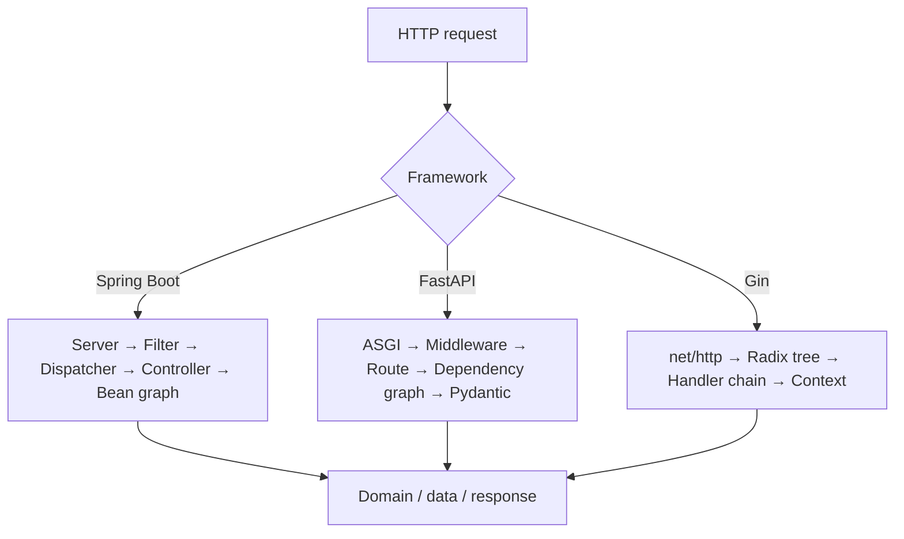

# Executive Summary

## 30秒版

- Spring Bootは「Springを本番アプリとして起動し運用するまで」を強く標準化する。大規模組織、統合、observability、security、data accessに強いが、classpath・annotation・container lifecycleの暗黙性と起動時コストが増える。
- FastAPIは「Python type hintをAPI contractのsingle source of truthにする」。validation、dependency graph、OpenAPI、editor supportをまとめる一方、process model、ORM、queue、production topologyは別途設計が必要。
- Ginは「`net/http` を壊さず、routingとrequest handlingを薄く高速化する」。最小の抽象化と単一binaryが利点だが、DI、OpenAPI、application architecture、observabilityの標準形は利用者が選ぶ。
- `modular-monolith-with-ddd` はこれらより上位のarchitecture。frameworkを選んでも、bounded context、module boundary、transaction、Outbox/Inbox、CQRS、architecture testは自動的には得られない。

## 2026-08-02時点の基準

| 対象 | 安定版 | Runtime requirement | Release |
|---|---:|---|---|
| Spring Boot | 4.1.0 | Java 17–26、Spring Framework 7.0.8+ | 2026-06-10 |
| FastAPI | 0.141.1 | Python 3.10+、Pydantic 2.9+、Starlette 0.46+ | 2026-07-29 |
| Gin | 1.12.0 | Go 1.25+ | 2026-02-28 |
| modular-monolith-with-ddd | releaseなし、commit `91c8ef2` | .NET 8 sample | repository HEADは約2年前 |

Spring Boot 4.1.0はgRPC、Jackson factory customization、HTTP clientのSSRF mitigation、OpenTelemetry改善、Log4j rotationなどを追加しました。FastAPI 0.141.1は0.141.0で追加された`app.frontend()`の修正を含みます。Gin 1.12.0はBSON、Context helper、custom type binding、escaped path option、Protocol Buffers content negotiationを追加しました。

## 選択の判断表

| 状況 | 第一候補 | 理由 |
|---|---|---|
| 複数team・長期運用・security/data/messaging/metricsを統合したい | Spring Boot | conventionとofficial integrationの範囲が広い |
| ML/data serviceやtyped Python APIを短期間で公開したい | FastAPI | type hint→validation→OpenAPIの距離が短い |
| 高throughput、小さいcontainer、明示的な構成、Go標準libraryとの互換性を重視 | Gin | 薄いlayerとzero-allocation router |
| 複雑なbusiness ruleを一つのdeployableに保ちたい | どれでもよい + modular monolith設計 | frameworkよりbounded contextとdependency ruleが重要 |
| CRUD中心でdomain complexityが低い | 最小の選択 | DDD/CQRSを全面導入するとceremonyが便益を超える |

## 同じrequestが通る経路

差が最も出るのはrouting速度ではなく、handlerに到達するまでにframeworkが解決する「意味」の量です。Spring Bootはapplication contextと多数のintegrationを、FastAPIは型・dependency・schemaを、Ginはpathとhandler chainを主に解決します。

## Data modelの違い

- Spring Boot: data modelはSpring Data JPA/JDBC/R2DBC/MongoDBなどのportfolioを自動構成できる。ただしBoot本体がORMではない。
- FastAPI: Pydantic modelはtransport/validation schemaであり、ORM entityやtransaction boundaryではない。SQLModelやSQLAlchemyは別project。
- Gin: struct tagによるbinding/validationはtransport model。永続化は`database/sql`やGORMなどを明示的に選ぶ。

「request DTO = domain entity = database row」を安易に一体化すると、3者のどれでも境界が崩れます。

## 性能の正しい読み方

- Gin公式の2026年3月router benchmarkでは203 routesを9,944 ns/op、0 allocations/opで処理した。ただし測っているのはrouterであり、JSON validation、DB、TLS、loggingを含むend-to-end APIではない。
- FastAPI公式も、Uvicorn → Starlette → FastAPIの順に機能が増えるほどoverheadが増えると明示している。追加機能を手書きした最終application同士で比較すべき。
- Spring Bootはstartup、RSS、steady-state latency、throughputを分ける。JVM warm-up、AOT/native image、Servlet/WebFlux、virtual threadsで結果が変わる。

このZIPのbenchmark planは同じOpenAPI、payload、validation、logging、error rate、warm-up、CPU limitで比較し、p50/p95/p99、throughput、CPU、RSS、startup、binary/image sizeを別々に記録します。

## Modular Monolithケーススタディから残すもの

残す価値が高いもの:

- bounded contextごとのmodule、data ownership、公開interface
- write sideはrich domain model、read sideは必要に応じて直接projectionするCQRS
- transaction内Outboxとidempotent Inbox
- logging / validation / unit of workをdecoratorとして適用
- architecture decision record、C4、architecture test、mutation test

そのまま移植してはいけないもの:

- すべてのmodule通信を非同期に固定すること。単一process内でもeventual consistencyの運用コストが出る。
- あらゆるCRUDへDDD/CQRSを適用すること。
- sampleのIdentityServer4とResource Owner Password Credentials flow。IdentityServer4 repositoryはarchiveされ、password grantは現在のsecurity guidanceに合わない。
- .NET 8を長期基準にすること。2026-08-02時点でmaintenance phase、support終了は2026-11-10。新規移植なら.NET 10 LTSを検討する。

## 新しいframeworkを設計するなら

1. 解決する抽象度を明言する。HTTP toolkit、API framework、application platformを混同しない。
2. hot pathを短く保ち、optional featureはpay-for-playにする。
3. type/schema metadataをvalidation、serialization、documentationへ再利用する。
4. defaultsは安全にし、適用理由をdiagnosticsで説明可能にする。
5. request scopeとresource cleanupを構造化する。
6. coreからORM、broker、auth providerを切り離す。
7. benchmarkは同等機能を測り、router microbenchmarkをapplication性能と呼ばない。
8. escape hatchを用意し、frameworkから標準libraryへ降りられるようにする。
