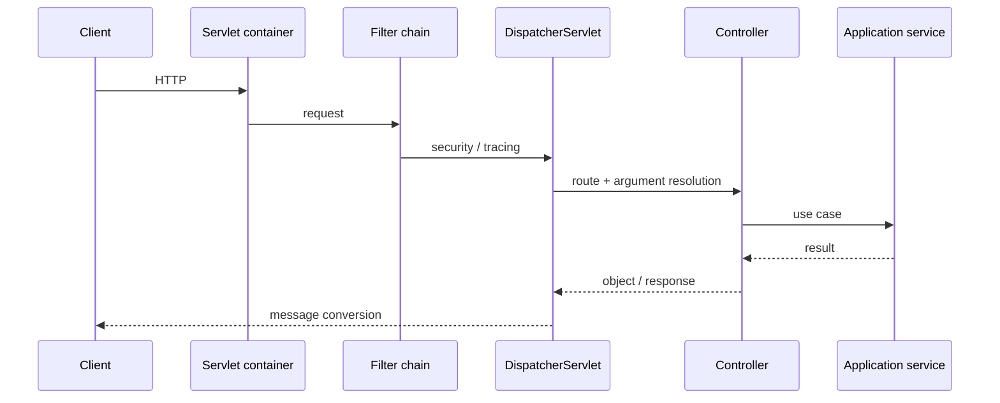
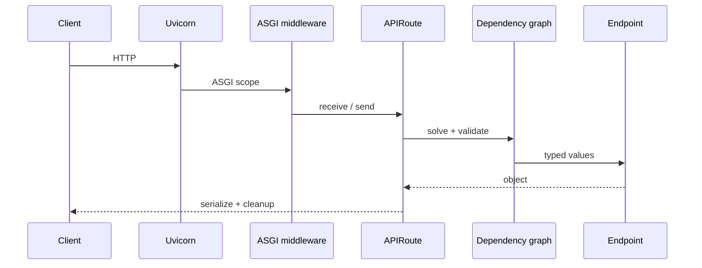
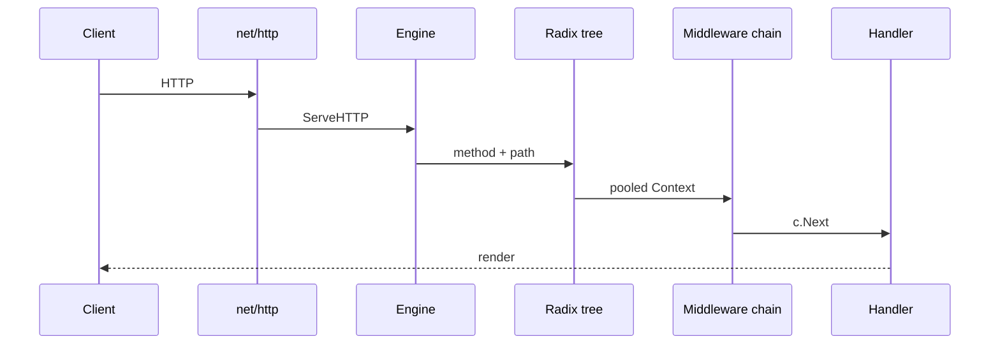

# Request lifecycleと内部構造

## 比較モデル

requestを次の8段階へ分けると、frameworkがどこで価値とcostを加えるかを比較できます。

1. socket/server
2. route matching
3. middleware/filter
4. context/scope生成
5. parameter・dependency解決
6. domain/application処理
7. serialization
8. cleanup/telemetry

## Spring Boot MVC

Bootはembedded Tomcat等を起動し、classpathとpropertiesからMVC componentsを自動構成します。requestはServlet Filterを通り、`DispatcherServlet`が`HandlerMapping`、`HandlerAdapter`、argument resolver、validation、message converterを調停します。controller自体はsingleton Beanが標準なので、request固有stateをfieldへ置いてはいけません。

transactionはcontrollerではなくapplication service境界へ置くのが安全です。`@Transactional` proxyを経由する必要があり、同一instance内self-invocationでは期待したinterceptorが働かない点が代表的な落とし穴です。

WebFluxではServlet thread-per-requestモデルではなくevent-loop/Reactive Streamsのlifecycleになるため、blocking driverを混ぜると利点を失います。Boot 4ではvirtual threadも選べますが、I/O libraryとThreadLocal/context propagationの検証が必要です。

## FastAPI

Uvicorn等がASGI `scope/receive/send`を作り、Starlette middleware/routerを経てFastAPIの`APIRoute`へ到達します。FastAPIはroute登録時にsignatureを解析してdependency graphとschemaを準備し、request時にquery/path/header/cookie/bodyとsub-dependencyを解決します。

dependencyはrequest内でdefault cacheされます。同一dependencyが複数経路から要求されても通常1回です。`yield` dependencyはcontext managerのようにresourceを生成し、response/error後にcleanupします。sync functionはthread pool、async functionはevent loopで実行されます。async endpoint内でblocking DB/client callを直接実行するとevent loopを塞ぎます。

Pydantic validation failureは通常422 responseへ変換されます。response modelがある場合はreturn objectも検証・filterされるため、内部fieldの意図しない漏洩を防げますが、serialization costも生じます。

## Gin

`Engine`は`http.Handler`です。`ServeHTTP`で`sync.Pool`から`Context`を得てresetし、method別radix treeでrouteを探索し、global/group/route handlerを一つのchainとして実行します。`c.Next()`前後でbefore/after middlewareを表現し、`Abort()`で後続を止めます。

bindingはstruct tagを読み、query/form/path/header/JSON/BSON等を構造体へ変換しvalidatorを呼びます。`Bind*`は失敗時にresponseを書き始める一方、`ShouldBind*`はerrorを返すため、error contractを統一したいapplicationでは後者が扱いやすいです。

`Context`はpoolへ戻るのでrequest外へ保持してはいけません。goroutineで参照する場合は`c.Copy()`を使い、response writerやrequest lifecycleとの競合を避けます。DB transaction/DI cleanupはGinが自動で持たないため、middlewareまたはapplication layerで明示します。

## costの発生地点

| 段階 | Spring Boot | FastAPI | Gin |
|---|---|---|---|
| startup | classpath scan、Bean graph、auto-config | import、route/schema作成 | route tree構築 |
| request | filter、argument resolver、conversion | dependency solve、Pydantic | radix match、handler chain、binding |
| cleanup | scope/proxy/transaction integration | `yield` dependency | user code/middleware |
| diagnostics | Actuator/condition report | OpenAPI/error details | logging/metricsを選択 |

最適化は最も時間を使う段階をprofileしてから行います。route matcherの差はDB/network callが支配するAPIではほぼ見えないことがあります。
