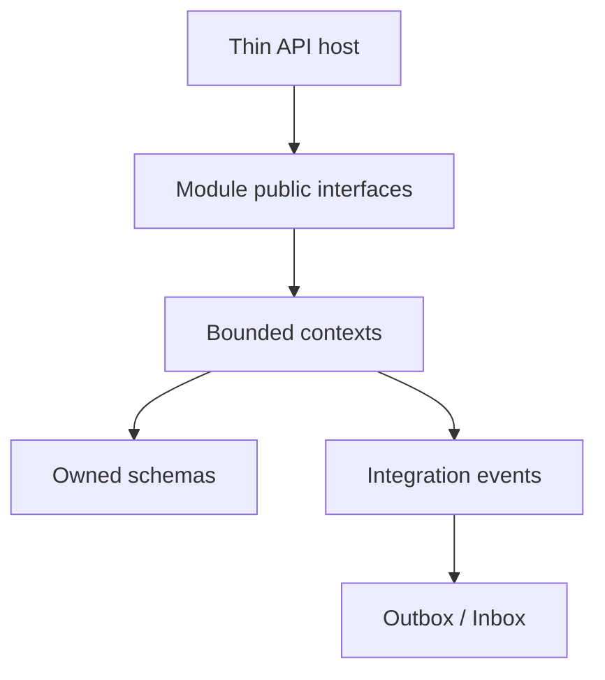

# Case Study: modular-monolith-with-ddd

対象: `kgrzybek/modular-monolith-with-ddd`、default branch `master`、commit `91c8ef24b4cb6ef558c95d8267fa07d68c7059f8`。

## 何を解くrepositoryか

Meetup型domainを、単一deployableの中でRegistrations、User Access、Meetings、Administration、Paymentsへ分割します。単なるfolder分割ではなく、各moduleにDomain/Application/Infrastructure/IntegrationEventsを置き、data schemaとcomposition rootを所有させます。

## 主なarchitecture decision

| Decision | 利点 | Cost / 注意 |
|---|---|---|
| 単一process modular monolith | deploymentとdebugが簡単 | process障害・scale単位は共有 |
| bounded context別module | domain languageとownershipを分離 | boundary設計が必要 |
| APIはmodule interfaceだけを呼ぶ | hostを薄く保つ | command/query型がpublic contract化 |
| schema ownership | accidental couplingを抑制 | cross-module queryが難しい |
| writeにClean Architecture + DDD | invariantをdomainに集約 | simple CRUDにはceremony |
| readにraw SQL projection | query最適化、単純 | read schemaの重複・migration |
| event-only module integration | autonomyと抽出可能性 | eventual consistency、debug、運用cost |
| Outbox/Inbox | crash間のat-least-onceを扱う | duplicate/idempotency、worker監視 |
| decoratorでlogging/validation/UoW | 横断関心を一貫適用 | orderとhidden behavior |
| architecture/mutation/system tests | 構造とtest品質を機械検証 | suite/tooling cost |

## requestからdomainまで

HTTP controllerはpermissionを確認し、module interfaceへCommand/Queryを送ります。Mediatorがhandlerを選び、commandにはvalidation、logging、unit of work decoratorが適用されます。write handlerはaggregateをrepositoryから得てpublic behaviorを呼び、domain eventを生成します。commit時にdomain eventをdispatchし、module外eventはOutboxへ保存します。

readはdomain aggregateを復元せず、view/raw SQLからDTOを作ります。この分離は複雑なreadに有効ですが、全endpointへ強制する必要はありません。

## integration semantics

repositoryはmodule直接呼び出しを禁止し、integration eventだけをin-memory busで配信します。transaction内Outboxへ保存し、workerがpublish、consumer側Inboxで重複処理を抑えます。これによりDB transactionとevent publicationのdual-write gapを縮めます。

ただし保証はexactly-onceではありません。producer/consumerはduplicateを許容し、ordering、retry、poison message、backlog、schema evolutionを設計する必要があります。in-memory busはprocess終了でdurabilityを持たず、Outbox workerの再送とsubscription wiringを十分testします。

## Event Sourcingの位置付け

Paymentsの一部はSQL Stream Storeでaggregateをeventから復元し、projectorがread modelを更新します。これは全module共通の必須形ではなく、payment lifecycleで選ばれた局所的な設計です。audit logとevent sourcingを区別し、stream versionによるoptimistic concurrency、projection checkpoint、event versioning、rebuildを考える教材になります。

## frameworkへのmapping

| Concern | Spring Boot | FastAPI | Gin |
|---|---|---|---|
| Module public API | Java package/interface、Spring Modulith検証 | Python package + service protocol | Go package + interface |
| Composition root | `@Configuration` / explicit Bean | app factory + dependency provider | `main` constructor wiring |
| Command dispatch | Spring/Application service、optional mediator | function/service dispatch | interface/service method |
| Validation decorator | Bean Validation/interceptor | Pydantic + dependency | binding validator + middleware |
| Transaction/UoW | `@Transactional` | session dependency/service UoW | explicit transaction helper |
| Outbox worker | transaction + scheduler/broker | DB + worker/queue | DB + goroutine/worker/broker |
| Architecture test | ArchUnit/Spring Modulith | import-linter/pytest custom rule | `internal/` + dep graph/static test |

framework機能へ1:1で翻訳しないことが重要です。例えばSpring event publisherを使っただけではdurable Outboxになりません。FastAPI dependencyはmodule境界そのものではありません。Go interfaceはdata ownershipを保証しません。

## 2026年に残すもの

- domain complexityに合わせたbounded contextとubiquitous language
- public API以外をinternalにするencapsulation
- aggregate単位transactionとrepository
- read/write modelを必要な場所だけ分ける
- transaction内Outbox、idempotent Inbox、observable worker
- ADR/C4/architecture tests/mutation tests
- real databaseを使うintegration testとeventual consistency probe

## modernizeするもの

1. .NET 8 sampleは2026-11-10にsupport終了予定なので、新規baseは.NET 10 LTSを検討する。
2. archivedのIdentityServer4とpassword grantを現行OIDC provider/flowへ置換する。
3. すべてのmodule interactionをevent-onlyにせず、consistencyとfailure semanticsで同期/非同期を選ぶ。
4. in-memory busの限界を明示し、broker移行時のordering、DLQ、backpressure、telemetryを設計する。
5. polling testを完全async/cancellableにし、未await taskとblocking sleepを除く。
6. current OpenTelemetry、container health、supply-chain checksをCIへ加える。
7. Event Sourcing libraryのmaintenance statusとmigration pathを再評価する。

## 適用しない方がよい場合

domainが単純、teamが小さい、寿命が短いCRUDで全patternを導入すると、handler/event/DTO/projectorの数が価値を上回ります。まずmodule ownership、transaction、simple serviceから始め、痛みが観測された境界へCQRS/Outbox/Event Sourcingを段階導入します。

## source reading guide

1. `README.md`のC4とmodule rules
2. `docs/architecture-decision-log/`のADR 0002、0004、0009、0010、0012、0014、0015
3. `src/API`のmodule initialization/controller
4. `src/Modules/Meetings`のDomain/Application/Infrastructure
5. Outbox/Inbox、InternalCommands、Payments Event Sourcing
6. UnitTests、IntegrationTests、ArchTests、SUT
